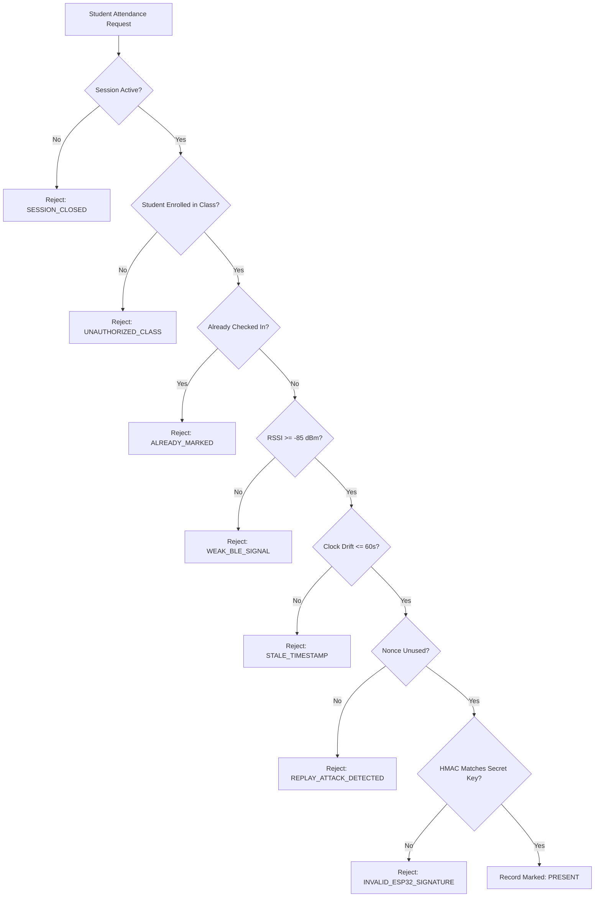

# Security Audit & Threat Model Analysis

This document provides a comprehensive security review of the College Classroom Attendance System, outlining threat scenarios and implemented cryptographic countermeasures.

---

## Threat Matrix & Countermeasures

| Threat Vector | Attack Scenario | Countermeasure Implemented |
| :--- | :--- | :--- |
| **Bluetooth MAC / Name Spoofing** | An absent student uses a Bluetooth beacon app to advertise `CLASSROOM_01` from a hostel room. | **Mitigated**: The system never trusts Bluetooth names or MAC addresses. The student's phone must complete a cryptographic HMAC challenge signed with the ESP32's internal 256-bit secret key. |
| **Packet Sniffing & Replay Attack** | A student sniffs the BLE packets of a classmate and retransmits the same bytes later. | **Mitigated**: Every handshake utilizes a fresh, cryptographically secure 32-byte random challenge ($C$). The backend verifies that the challenge nonce has not been consumed before and marks it as used in `challenge_nonces`. Any duplicate is rejected. |
| **Delayed Submission (Time Shifting)** | A student captures the ESP32 response in the morning, skips class, and submits the payload in the evening. | **Mitigated**: The timestamp is included in the canonical payload $M$ signed by the ESP32. The backend enforces $|T_{\text{server}} - T_{\text{client}}| \le 60\text{ seconds}$. Stale timestamps are rejected with `STALE_TIMESTAMP`. |
| **Credential Sharing (Proxy Attendance)** | Student Alice marks attendance in class, then sends her signature to absent Student Bob to submit. | **Mitigated**: The student's unique enrollment number is bound into the signed payload $M$. Bob cannot use Alice's signature because his backend request will hash his own enrollment number, resulting in a signature mismatch (`INVALID_ESP32_SIGNATURE`). |
| **Classroom Relaying** | Student sitting in Class A tries to mark attendance for Class B. | **Mitigated**: Attendance sessions are strictly tied to a specific `class_id` and assigned `esp32_id`. Cross-class submissions are rejected with `DEVICE_MISMATCH` or `UNAUTHORIZED_CLASS`. |
| **Hallway / Drive-by Attendance** | A student attempts to mark attendance while walking past the classroom door in the hallway. | **Mitigated**: RSSI filtering enforces a minimum signal strength ($\ge -85\text{ dBm}$). Weak signals through walls are rejected with `WEAK_BLE_SIGNAL`. |
| **Denial of Service via BLE GATT Hogging** | Malicious or unintentional blocking of BLE connection slots preventing other students from marking attendance. | **Mitigated**: The ESP32 enforces an aggressive 100ms connection disconnect delay. As soon as the HMAC response is notified, the client is disconnected, and the slot is freed. Client-side randomized exponential backoff prevents synchronized stampedes. |
| **Database Key Compromise** | Exposure of the database credentials. | **Mitigated**: Keys are scoped per device. A compromised device key only affects that single room and can be rotated with one click via `PUT /api/devices/:id/rotate-key`. |

---

## Verification Pipeline Diagram

